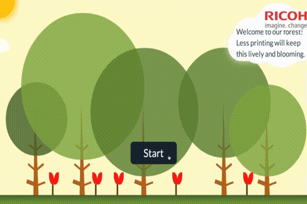
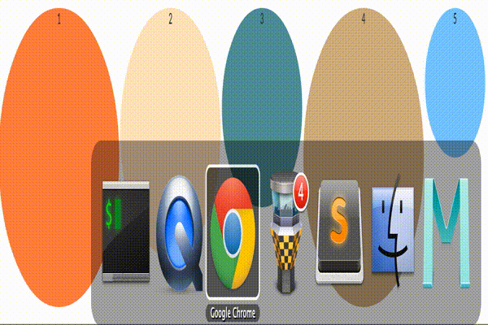

# greenpi

> raising environmental consciousness within an organization

##development

1. start redis

	```
	redis-server
	```
	
1. start kraken with node and visit browser [localhost:9000](http://localhost:9000/)

	```
	node index.js 
	```

1. compile sass to css

	```
	gulp
	```

##deploy to raspberrypi

1. ssh into the greenpi
1. go to `~/apps/greenpi` and get the latest repo code

	```
	git pull
	npm install
	gulp
	npm start
	```
1. visit browser [localhost:9000](http://localhost:9000)

##changelog

1. `v0.7.0` simplified to static cloud messages
1. `v0.6.0` simplified tree branches, removed animations
1. `v0.2.0` simulation at every interval 1 Apr 2014

  

1. `v0.1.0` reducing trees [e357d9a](https://github.com/ManagedApplicationServices/greenpi/commit/e357d9a0338ca0231798968c26b68fec6caadef3) 26 Mar 2014

	
	

