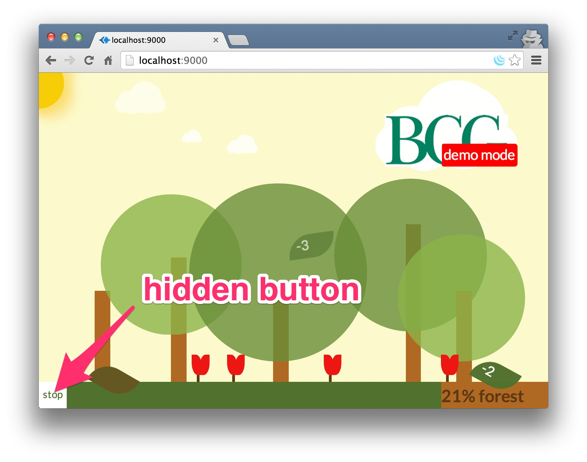

<title>GreenPI</title>
<div class="navbar navbar-fixed-top"></div>
<br><br><br><br><br><br><br><br><br>


<xmp theme="Cerulean" style="display:none;">

# greenpi

> raising environmental consciousness within an organization

<div style="page-break-after: always;"></div>


##Getting started

1. plug in the RaspberryPI to the small LCD with a HDMI connector
1. plug in the Raspberry PI to power with a micro-usb connector
1. Wait for about **90 seconds**
1. You should see the main screen on the tiny LCD

	

1. In your administrator computer, find out the IP address of this RaspberryPI by scanning the connected devices to your router. E.g. `192.168.1.149`
1. Visit the IP address in your computer's Chrome browser. E.g. `192.168.1.149:9000`	
1. Visit the admin page in your computer's Chrome browser. E.g. `192.168.1.149:9000/admin`. The default login credentials are:

	```
	User Name: sprout
	Password: greenpi
	```	
	
		
	
1. Add the admin details accordingly on the admin page after logging in succesfully:

	```
	Current printer IP [192.168.1.172]
	Organisation CAP [1000000]
	Total printers [4]
	
	Company Logo 	[upload an image]  
	
	Posters  		
						[upload an image]
						[upload an image]
	 					[upload an image]
	 					[upload an image]
	 					[upload an image]
	
	New password
	Confirm password
	```
	
	
	
1. Go to the main page `192.168.1.149:9000` from your admin computer and click start.

###future changes

Just go to any browser fro your admin laptop and access

1. **Change Settings**: To change any admin settings such as posters or logo access the raspberry pi's ip from your admin computer's browser again. E.g. `192.168.1.149:9000/admin`
1. **Stop simulation**: To stop the simulation and restart it clikc the hidden `STOP` simulation button as shown below.

	

1. **Start simulation**: To start the simulation just click the `START` button in the middle of the screen.

	


<div style="page-break-after: always;"></div>

##Equipment

1. Raspberry PI Model B++
1. Micro USB power adapter for pi
1. LCD screen
1. HDMI cable for the LCD
1. Power cable for the LCD
1. 8GB SD Card (Speed 10x) 

<div style="page-break-after: always;"></div>

##install in a raspberry pi

1. clone the repo

	```
	git clone git@github.com:ManagedApplicationServices/greenpi.git
	```
1. create the config file

	```
	cp config.sample.json config.json
	```
1. edit the config file `sudo nano config.json`

	```
	{
    "printerIP": "172.19.107.61",
    "paperUsageCap": 96,
    "totalPrinters": 4,
    "appPath": "/path/to/app",
    "paperUsagePath": "/web/guest/en/websys/status/getUnificationCounter.cgi",
    "machineDetailPath": "/web/guest/en/websys/status/configuration.cgi",
    "username": "sprout",
    "passwordHash": "$2a$08$oAXUGmm186QSjofIjM.fLur6ru7S6KW3L5gw9.wBMW9T9imqL/tSC"
}
	```	
1. install bower and npm packages

	```
	npm install
	bower install
	```
1. start the server

	```
	$ node index.js
	```
1. go to url [localhost:9000/admin](localhost:9000/admin) to amend the settings. default settings are:

	- username: `sprout`
	- password: `greenpi`


##deploy to raspberrypi

1. ssh into the greenpi

	```
	ssh greenpi	
	```
1. go to `~/apps/greenpi` and get the latest repo code

	```
	git pull
	npm install && bower install
	node index.js
	```
1. visit browser [localhost:9000](http://localhost:9000)

##install for development

1. start redis

	```
	redis-server
	```
	
1. start kraken with node and visit browser [localhost:9000](http://localhost:9000/)

	```
	nodemon index.js 
	```


##prepare sd card from brand new rpi

###1. initial setup

1. **Install**: [raspbian](http://www.raspberrypi.org/downloads/) with Noobs on a 8GB SD Card (speed 10x)
1. **bootup**: rpi and login with default credntials:

	```
	login: pi
	password: raspberry
	```
1. general configuration with `sudo raspi-config`
1. **Hostname and Hosts**
	1. set hostname of the rpi in file `/etc/hostname`

		```
		greenpi
		```
	1. set host of the rpi in file `/etc/hosts` in the last line

		```
		127.0.1.1	greenpi
		```
1. **Keyboard**
	1. change the keyboard layout to US
	
		```
		sudo nano /etc/default/keyboard
		```

1. **add new user**
	1. add new user `developer` and its password
	
		```
		sudo useradd -m developer
		sudo passwd developer
		```
	1. add user `developer` to sudoers list in file `/etc/sudoers` at the last line

		```
		developer ALL=(ALL) NOPASSWD: ALL
		```	

1. **update** packages with an ethernet connection

	```
	sudo apt-get update
	sudo apt-get upgrade
	```

1. setup wifi accordingly
1. **screen resolution**: edit file `/boot/config.txt`
	
	```
	disable_overscan=1
	framebuffer_width=1280
	framebuffer_height=800
	```	
1. **setup ssh**: ensure the ssh keys are stored in user folder `/home/developer/.ssh` and not under the root
1. **shutdown / restart**

	1. shutdown
	
		```
		sudo shutdown now
		```
	1. reboot
	
		```
		sudo reboot	
		```

##configure RPi kiosk mode

1. edit file `/home/developer/.xinitrc`

	```
	unclutter -idle 15 -root &
	xset -dpms &
	xset s off &
	
	cd ~/apps/greenpi
	/home/developer/.nvm/v0.10.26/bin/node index.js & > greenpi_xinitrc_log.log 2> greenpi_xinitrc_error.log
	sleep 10
	
	while true; do
	        killall -TERM chromium 2>/dev/null;
	        sleep 2;
	        killall -9 chromium 2>/dev/null;
	        chromium --incognito --kiosk --window-size=1280,800 --window-position=0,0 http://localhost:9000
	done;
	```
1. edit file `/etc/rc.local` with login as user `developer` and `startx`

	```
	#!/bin/sh -e
	#
	# rc.local
	#
	# This script is executed at the end of each multiuser runlevel.
	# Make sure that the script will "exit 0" on success or any other
	# value on error.
	#
	# In order to enable or disable this script just change the execution
	# bits.
	#
	# By default this script does nothing.
	
	# Print the IP address
	
	su -l developer -c startx &
	
	_IP=$(hostname -I) || true
	if [ "$_IP" ]; then
	  printf "My IP address is %s\n" "$_IP"
	fi
	
	exit 0
	```
1. edit file `/boot/cmdline.txt` to hide bootup text

	```
	dwc_otg.lpm_enable=0 console=ttyAMA0,115200 console=tty3 root=/dev/mmcblk0p6 rootfstype=ext4 elevator=deadline rootwait loglevel=3
	```
1. exit kiosk mode to command line press:

	```
	Ctrl + Alt + F2
	```

##create splash screen

**Note**: Reference on [how to create the splash screen](http://www.edv-huber.com/index.php/problemloesungen/15-custom-splash-screen-for-raspberry-pi-raspbian). This splash screen will only be available after complete boot up.

1. install frame buffer image

	```
	sudo apt-get install fbi
	```
1. create a daemon file `/etc/init.d/asplashscreen`

	```
	#!/bin/sh
	
	do_start () {
	
	    /usr/bin/fbi -T 1 -noverbose -a /etc/splash.jpg
	    exit 0
	}
	
	case "$1" in
	  start|"")
	    do_start
	    ;;
	  restart|reload|force-reload)
	    echo "Error: argument '$1' not supported" >&2
	    exit 3
	    ;;
	  stop)
	    # No-op
	    ;;
	  status)
	    exit 0
	    ;;
	  *)
	    echo "Usage: asplashscreen [start|stop]" >&2
	    exit 3
	    ;;
	esac
	
	:
	```
1. make it executable

	```
	sudo chmod a+x /etc/init.d/asplashscreen
	```
1. move an image to `/etc/splash.jpg`

##configure RPi Wifi (WPA personal)

1. edit file `sudo nano /etc/network/interfaces`

	```
	auto wlan0
	auto lo
	
	iface lo inet loopback
	iface eth0 inet dhcp
	
	allow-hotplug wlan0
	iface wlan0 inet dhcp
	
	wpa-conf /etc/wpa_supplicant/wpa_supplicant.conf
	```
1. edit config file `sudo nano /etc/wpa_supplicant/wpa_supplicant.conf`

	```	
	ctrl_interface=DIR=/var/run/wpa_supplicant GROUP=netdev
	update_config=1

	network={
		ssid="your ssid"
		psk="password"
		proto=WPA
		key_mgmt=WPA-PSK
		pairwise=TKIP
		auth_alg=OPEN
	}
	
	network={
		ssid="another ssid"
		psk="password"
		proto=WPA
		key_mgmt=WPA-PSK
		pairwise=TKIP
		auth_alg=OPEN
	}
	``` 
1. shutdown and restart connection

	```
	sudo /etc/init.d/networking restart # method 1
	sudo ifdown wlan0 # method 2
	sudo ifup wlan0
	```	
1. check connection

	```
	ping 8.8.8.8
	```
1. get rpi's ip address

	```
	ifconfig # read wlan0, 2nd line: inet addr
	```

##backups for the sd card images

###get the backups

1. All SD card images can be found in RSP AWS S3 bucket `rspdeveloper`. Versions correspond to git tags deployed to production in the Raspberry PI.

	

###creating backups for sd cards

1. shutdown the pi properly through ssh

	```
	sudo shutdown now
	```
1. pull out the SD card from the pi and insert it into your computer
1. see all connected devices to your computer and recognise your SD card

	```
	df -h
	```
1. make an image of the SD Card with the name corresponding the the git tag shipped to production (raspberry pi)

	```
	sudo dd bs=1m if=/dev/disk1 of=greenpiV0.14.0.img
	```
1. zip the image

	```
	tar -cvzf greenpiV0.14.0.img.gz greenpiV0.14.0.img
	```
1. Store it somewhere. E.g. Upload to AWS S3 bucket `rspdeveloper`


##changelog

1. `v0.13.0` printer info is gotten upon clicking the start button
1. `v0.12.0` refresh page, async pattern and demo mode
1. `v0.10.0` connected to live printer data
1. `v0.9.0` rotating posters at intervals of 2.5 minutes
1. `v0.8.1` moved the last tree away from the right scrollbar and positioned the graph
1. `v0.8.0` moved everything away from right scrollbar of the browser
1. `v0.7.0` simplified to static cloud messages
1. `v0.6.0` simplified tree branches, removed animations
1. `v0.2.0` simulation at every interval 1 Apr 2014
1. `v0.1.0` reducing trees [e357d9a](https://github.com/ManagedApplicationServices/greenpi/commit/e357d9a0338ca0231798968c26b68fec6caadef3) 26 Mar 2014

	


</xmp>
<script src="http://strapdownjs.com/v/0.2/strapdown.js"></script>
<script src="http://code.jquery.com/jquery-1.11.0.min.js"></script>
<script>
	var $head = $("head");
	var style = $("<link href='http://fonts.googleapis.com/css?family=Open+Sans:300' rel='stylesheet' type='text/css'>"
+"<style> "
+"	body, h1, h2, h3, h4, h5, p {"
+"		font-family: 'Open Sans', sans-serif, Helvetica, Arial, sans-serif !important;"
+"      font-weight: 300 !important"
+"	}"
+"	body, p {"
+"		text-align: justify !important;"
+"		text-justify: inter-word !important;"
+"	}"
+"</style>");
	$head.append(style);
</script>


